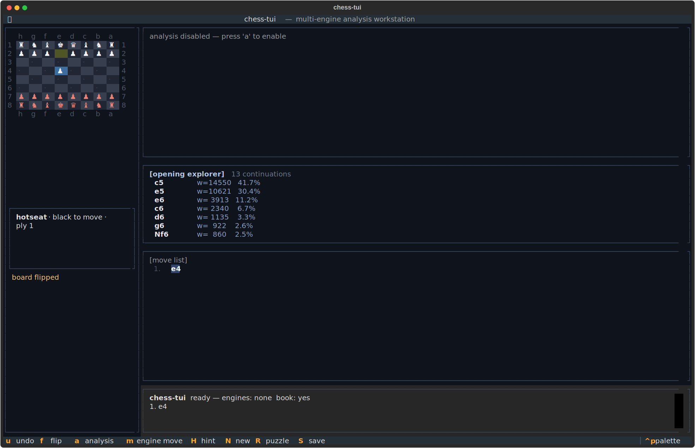

# chess-tui
The board is the only opponent.




## About
Offline analysis, the way the grandmasters dream it. Stockfish and GNU Chess running side-by-side with live MultiPV eval bars. Polyglot opening book, Lichess-style puzzle trainer, PGN load and save, REST API, zero network dependency. A terminal workstation for the endless endgame. No account. No timeout. Just the board and the engines.

## Screenshots


## Install & Run
```bash
git clone https://github.com/akakabrian/chess-tui
cd chess-tui
make
make run
```

## Controls
<Add controls info from code or existing README>

## Testing
```bash
make test       # QA harness
make playtest   # scripted critical-path run
make perf       # performance baseline
```

## License
MIT

## Built with
- [Textual](https://textual.textualize.io/) — the TUI framework
- [tui-game-build](https://github.com/akakabrian/tui-foundry) — shared build process
